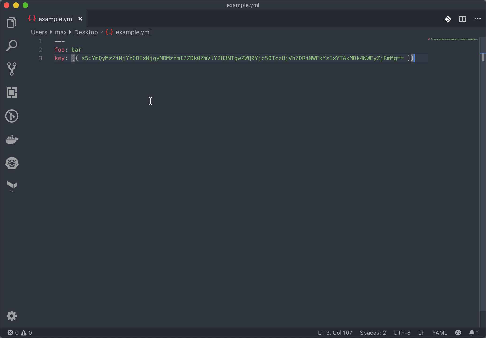

# vscode-s5

This is a [vscode](https://code.visualstudio.com/) extension for [s5](https://github.com/mvisonneau/s5)



## Installation / Configuration

Once you have [installed the extension](vscode:extension/mvisonneau.s5), you will need to configure the [secret provider](https://github.com/mvisonneau/s5#encryption-backends-supported) you want to use.

```json
// PROVIDER
//  - aes: Use AES-GCM as the encryption backend
//  - aws: Use AWS-KMS as the encryption backend
//  - gcp: Use GCP-KMS as the encryption backend
//  - pgp: Use PGP as the encryption backend
//  - vault: Use Vault transit as the encryption backend
"s5.provider": "aes",

// AES
"s5.aes.key": "",

// AWS
"s5.aws.accessKeyID": "",
"s5.aws.kmsKeyARN": "",
"s5.aws.secretAccessKey": "",
"s5.aws.sessionToken": "",

// GCP
"s5.gcp.kmsKeyName": "",

// PGP
"s5.pgp.privateKeyPath": "",
"s5.pgp.publicKeyPath": "",

// VAULT
"s5.vault.address": "http://127.0.0.1:8200",
"s5.vault.token": "",
"s5.vault.transitKey": "default",
```
